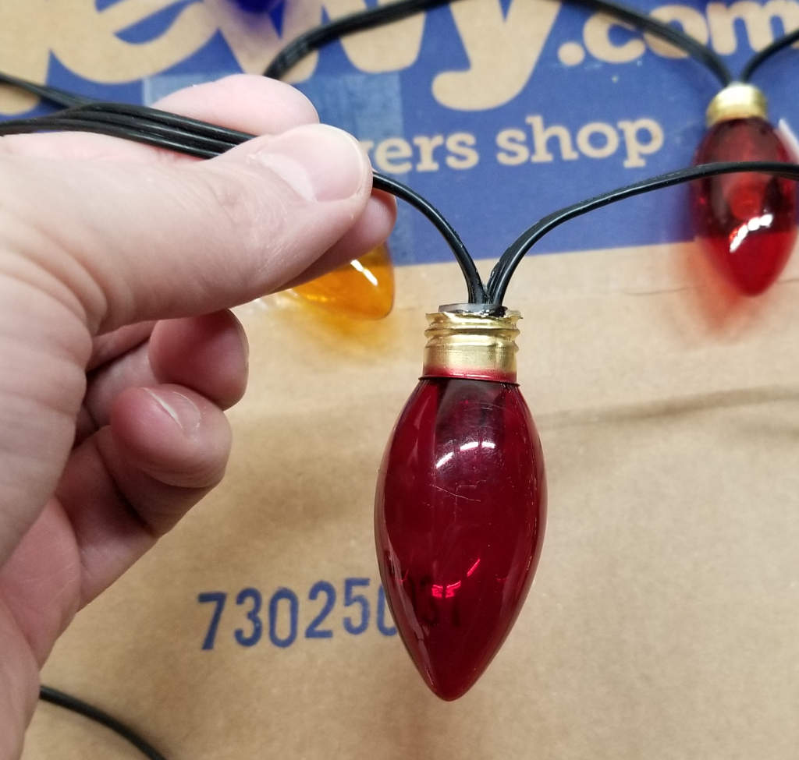
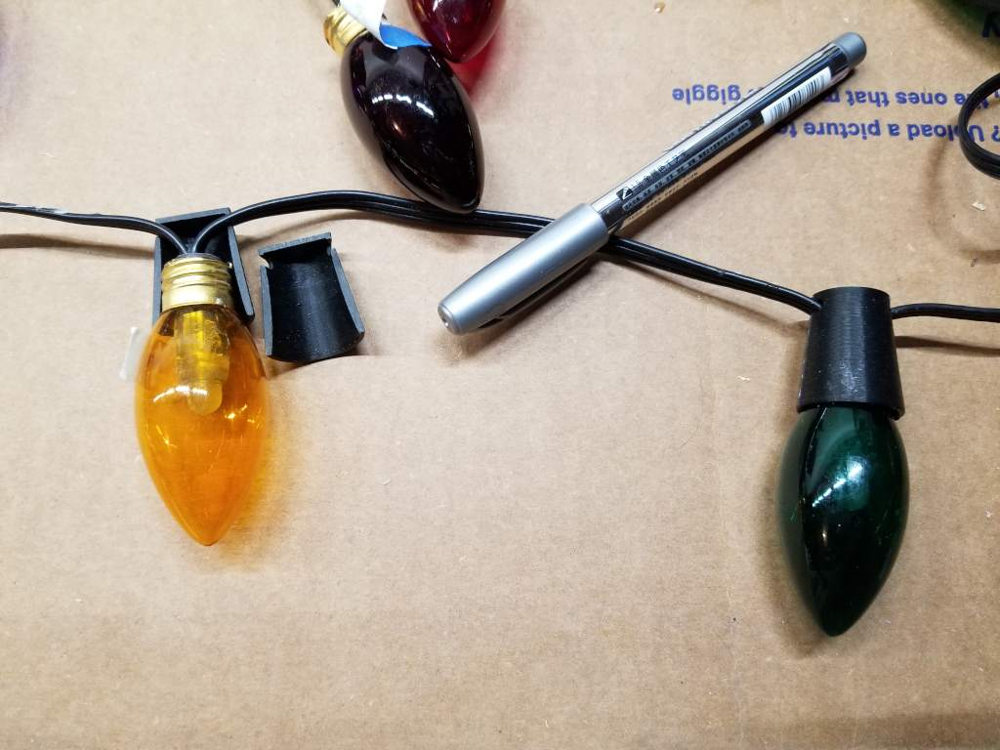
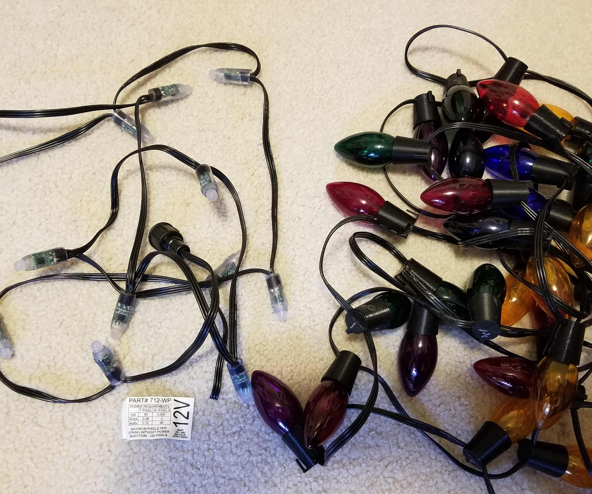

# Stranger Things Lights

I bought this tapestry sort of thing from the Halloween store that has the letters and the wallpaper like it's the house from Stranger Things. Over each letter there's a little hook where you can attach a light. The lights that came with it are kinda janky cheap things and they just stay on or they blink, but that's it. Here's what that original item looks like:

This sketch is based on several that I've seen around the place, but is specifically for my use case where the bulbs start a certain color (based on the best look for each given the glass bulb covering). [Here's a video showing what it looks like when it's done.](https://www.youtube.com/watch?v=nxTzynmiZcY)

## Making the Lights

I bought some lights from [HolidayCoro.com](http://holidaycoro.com) - specifically the [12V 6"-spaced RGB 2811](http://www.holidaycoro.com/6-Inch-Pixel-Node-String-Waterproof-Plug-12v-p/712-wp.htm) lights. I got these instead of the C9 bulb version because I wanted the bulbs to look like _actual colored glass bulbs_ rathre than clear bulbs with colored lights. I'm not interested in changing the colors of the bulbs _too much_ - I'm more interested in the ability to control the general look of each bulb and individually control them. I also specifically wanted something with a dark cord (black, in this case) and didn't want a whole bunch of extra lights (so 3" spacing is out - the 6" spacing is pretty good, though I wish I could have found 8" or so).

I bought a bunch of actual colored glass C9 bulbs from Amazon. I took a Dremel and cut the end of the metal part of the bulb off. Using needlenose pliers I broke out the center of the bulb with the filament. This leaves a hole in the base where you can insert the LED. You have to clean up some of the glue on the inside of the metal part of the bulb, but they will end up fitting snugly over the top of the LEDs. I took a bit of epoxy and glued them over the top of the LEDs.

I 3D printed some fake "sockets" that fit over the base of the lights once the bulbs are on. I used superglue to affix these bases over the lights. (I put the .stl files for the sockets in the `doc` folder.) I used a silver marker to mark the top of the light sockets to indicate which letter goes to which bulb. This makes it easier to test and program later, as well as ensuring when you hang the lights up you get it consistent.

When it's all done, you have an old-school looking set of lights. Here's a before and after shot. This also shows the label on the lights so you can see exactly what I bought.

## The Arduino Sketch

I used the VS Code Arduino extension for development. It does require the Arduino IDE be installed, so if that's your jam, awesome. Otherwise there's a `.vscode` folder with things set up. Note the `c_cpp_properties.json` has paths to things on _my machine_. Every time I tried to make this generic and use profile folder variables, the extension would rewrite the contents. I gave up trying to fix it.

The VS Code default build task is set up to be the `Arduino: Verify` action from the extension. You can't use the C++ extension to build, it won't work. C++ is only used for Intellisense.

Use the `Arduino: Upload` action to send it to your Arduino. The `arduino.json` file defines what board and port you're using. I use an Arduino Uno.

The sketch is set up for exactly the number and type of lights I have. You can see in the `setup` method where the strand gets initialized.

Each light is set to roughly match the color of the glass bulb that's on it. I randomized these so it would look like a strand that's had a life, where some lights have been replaced and it's no longer totally consistently distributed. You can adjust the `initializeDefaults` method to match your bulbs/distribution.

Be aware that the lights I bought use a 12V power supply and need a 5V data feed. I bought a simple 12V 2A power supply off Amazon and it feeds both the lights and the Arduino. **You need both the lights and the Arduino plugged in while programming.** If you only plug the lights in and the Arduino is on USB power, the data feed to the lights will only be 3.3V. The lights won't work right without a 5V data signal. You'll only get that if the lights _and_ the Arduino are plugged in. I lost a day figuring this out.

I'm honestly not really writing the sketch to be reused directly. If you want to grab it and use it, awesome. It's pretty clearly documented and shouldn't be too hard to mess with. That said, I won't be allowing issues or whatever because it's more "sample code" and not something I intend on supporting.
