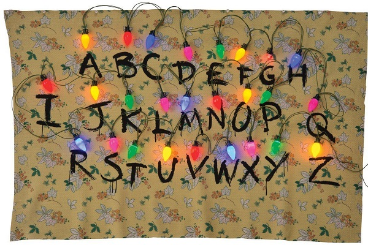

# Stranger Things Lights

I bought this tapestry sort of thing from the Halloween store that has the letters and the wallpaper like it's the house from Stranger Things. Over each letter there's a little hook where you can attach a light. The lights that came with it are kinda janky cheap things and they just stay on or they blink, but that's it. Here's what that original item looks like:

I bought some lights from [HolidayCoro.com](http://holidaycoro.com) - specifically the [12V 6"-spaced RGB 2811](http://www.holidaycoro.com/6-Inch-Pixel-Node-String-Waterproof-Plug-12v-p/712-wp.htm) lights. I got these instead of the C9 bulbs because I wanted the bulbs to look like actual colored glass bulbs. They don't have those in stock. (I'm not interested in changing the colors of the bulbs _too much_ - I'm more interested in the ability to control the general look of each bulb and individually control them.) I also specifically wanted something with a dark cord (black, in this case) and didn't want a whole bunch of extra lights (so 3" spacing is out - the 6" spacing is pretty good, though I wish I could have found 8" or so).

I also bought a bunch of actual C9 bulbs from Amazon. I took a Dremel and cut the end of the metal part of the bulb off. After you clean up some of the glue on the inside of the metal part of the bulb, they fit snugly over the top of the lights. I 3D printed some fake "sockets" that fit over the base of the lights once the bulbs are on. A little epoxy and they look like a string of actual old school C9 bulbs.

This sketch is based on several that I've seen around the place, but is specifically for my use case where the bulbs start a certain color (based on the best look for each given the glass bulb covering).

I'm not really writing the sketch to be reused directly. If you want to grab it and use it, awesome. I won't be allowing issues or whatever because it's more "sample code" and not something I intend on supporting.
